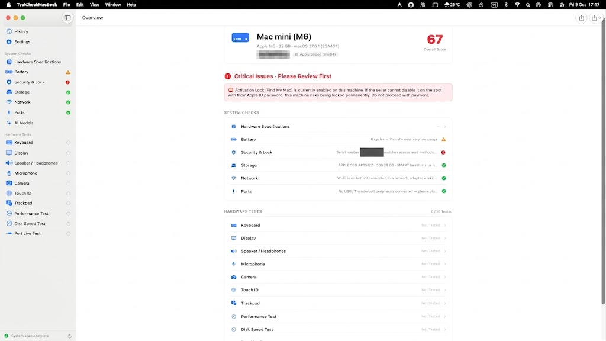

# ToolCheckMacBook 🍏🔍

<p align="center">
  <strong>All-in-one native macOS hardware diagnostic, inspection, and verification tool.</strong><br>
  <em>Công cụ kiểm tra phần cứng, chẩn đoán và thẩm định MacBook / Mac toàn diện chạy hoàn toàn offline.</em>
</p>

<p align="center">
  <a href="https://huytran1120.github.io/ToolCheckMac/"><strong>🌐 Official Website</strong></a> •
  <a href="#english"><strong>English</strong></a> •
  <a href="#tiếng-việt"><strong>Tiếng Việt</strong></a>
</p>

<p align="center">
  
  
  
  
  
</p>

---

<p align="center">
  
</p>

---

<a name="english"></a>
## 🌐 English

### Overview

**ToolCheckMacBook** is a native, offline macOS hardware inspection tool designed for second-hand Mac buyers, retail stores, IT technicians, and Mac enthusiasts. It provides automated detection of internal hardware, health metrics, and fraud red flags, alongside a full suite of interactive hardware diagnostics (keyboard, screen, audio, trackpad, disk speed, etc.), and exports professional PDF/PNG diagnostic reports.

### ✨ Key Features

#### 1. Automatic System & Hardware Inspection
* **Device Identification:** Resolves accurate marketing names (e.g. `MacBook Pro (14-inch, 2021)`), Apple Silicon / Intel architecture, chip variant, memory, and OS version.
* **Serial Number Anti-Tampering:** Cross-checks hardware serial numbers between IOKit kernel layer and `system_profiler` to identify spoofed identities.
* **Battery Health & Cycles:** Reads raw cycle counts, health percentage, design vs. max capacity, battery temperature, and charging status via `IOKit`.
* **Security & Lock Verification:**
  * Detects Apple DEP / MDM Enterprise management profiles.
  * Checks Apple ID sign-in status, Find My Mac, and Activation Lock risks.
  * Identifies Security Chip tier (Apple Silicon Secure Enclave, T2 Security Chip, or legacy Intel).
* **Storage & NVMe SMART:** Reads SMART health, Total Bytes Written (TBW), power-on hours, unsafe shutdowns, and spare capacity.
* **Network & Connectivity:** Inspects Wi-Fi adapter state, PHY modes (Wi-Fi 6/5), Tx rate, and Bluetooth controller version.
* **Ports & Interfaces:** Detects physical USB and Thunderbolt / USB4 buses and connected peripherals.

#### 2. Interactive Hardware Diagnostics
* **Keyboard Test:** Visual keyboard matrix that lights up keys upon physical press. Detects sticky, unresponsive, or ghosting keys.
* **Display Test:** Fullscreen testing suite including pure black, pure white, RGB primaries, grayscale gradients, and checkerboards to easily spot dead/stuck pixels and backlight bleeding.
* **Speaker & Headphones:** Plays stereo sweeps through isolated Left and Right audio channels.
* **Microphone Test:** Live RMS input level visualizer to verify microphone sensitivity without recording or saving audio.
* **Camera Test:** Live camera preview to verify webcam sensor clarity and spot lens defects.
* **Touch ID Test:** Prompts biometric authentication via `LocalAuthentication` to confirm sensor functionality.
* **Trackpad Test:** Canvas drawing with gesture recognition (multi-finger pan, pinch, rotate) and Force Touch pressure gauge.
* **Disk Speed Benchmark:** Real-time read/write performance testing bypassing OS cache (`F_NOCACHE`), measuring genuine SSD throughput (MB/s).
* **Performance Stress Test:** Multi-core CPU stress benchmark monitoring real-time thermal throttling states (`Nominal`, `Fair`, `Serious`, `Critical`).
* **Live Port Plug/Unplug Test:** Live USB tree differential detection to verify each physical port as devices are inserted or removed.

#### 3. AI Model Advisor
* Analyzes unified memory capacity and recommends suitability for local Open-Weight LLMs (Llama 3, DeepSeek, Qwen 2.5, Mistral, Gemma 2, Phi).
* Classifies model runnable tiers: *Runs Smoothly*, *Runnable*, *Barely Runnable*, or *Not Recommended*.

#### 4. Reports & History Management
* **Overall Scoring:** Calculates a weighted 0–100 score, immediately isolating critical **⛔ Red Flag Issues** (MDM enrollment, Activation Lock, serial mismatch).
* **Export Reports:** Generates standalone high-resolution PNG snapshots or multi-page PDFs.
* **History Comparison:** Automatically stores local snapshots to track wear and compare performance over time.

---

### 🔒 Privacy & Security Pledge

1. **100% Offline:** The app contains zero network networking code (`URLSession`, sockets, telemetry, or remote tracking). No data ever leaves your device.
2. **Read-Only System Commands:** Gathers hardware data using standard macOS system tools (`system_profiler`, `ioreg`, `profiles status`, `defaults read`).
3. **No Root / Sudo Required:** Runs safely under standard user permissions without asking for root access or installing background daemons.
4. **Safe Testing:** Disk benchmarks create a temporary test file that is deleted immediately upon completion. Camera and microphone tests never write audio/video to disk.

---

### 💻 System Requirements

* **Operating System:** macOS 14.0 (Sonoma) or later
* **Hardware:** Apple Silicon (M1/M2/M3/M4 series) or Intel Mac
* **Xcode:** Xcode 16.0+ (if compiling from source)
* **Optional:** `xcodegen` (for regenerating the Xcode project file)

---

### 🛠️ Building from Source

```bash
# 1. Clone repository
git clone https://github.com/<your-username>/ToolCheckMacBook.git
cd ToolCheckMacBook

# 2. (Optional) Regenerate Xcode project with XcodeGen
brew install xcodegen
xcodegen generate

# 3. Build Release binary
xcodebuild \
  -project ToolCheckMacBook.xcodeproj \
  -scheme ToolCheckMacBook \
  -configuration Release \
  -derivedDataPath ./build \
  CODE_SIGN_IDENTITY="-" \
  CODE_SIGNING_REQUIRED=NO
```

The compiled application bundle will be located at:
```text
build/Build/Products/Release/ToolCheckMacBook.app
```

To run the application:
```bash
open ./build/Build/Products/Release/ToolCheckMacBook.app
```

---

### 📦 Packaging DMG

A build and packaging script is included:

```bash
./scripts/build_and_notarize.sh
```

Output file:
```text
~/Desktop/ToolCheckMacBook-1.2.dmg
```

For official Developer ID signing and Apple notarization, configure environment variables prior to running the script:
```bash
export TOOLCHECKMACBOOK_SIGN_ID="Developer ID Application: Your Name (TEAMID)"
export TOOLCHECKMACBOOK_NOTARY_PROFILE="toolcheckmacbook-notary"
./scripts/build_and_notarize.sh
```

---

### ❓ Troubleshooting

* **macOS Gatekeeper Warning ("App is damaged" or "Unidentified Developer"):**
  If you open an ad-hoc or self-built version and macOS prevents launch, remove the quarantine attribute:
  ```bash
  sudo xattr -rd com.apple.quarantine /Applications/ToolCheckMacBook.app
  ```
  Or right-click `ToolCheckMacBook.app` in Finder and select **Open**.

* **Permission Prompts:**
  When testing the Camera, Microphone, or Bluetooth, macOS will ask for permission. If denied, enable them manually in **System Settings › Privacy & Security**.

---

### 📄 License

This project is licensed under the MIT License - see the [LICENSE](LICENSE) file for details.

---

<br>
<hr>
<br>

<a name="tiếng-việt"></a>
## 🇻🇳 Tiếng Việt

### Giới thiệu tổng quan

**ToolCheckMacBook** là ứng dụng macOS chuyên dụng, hỗ trợ kiểm tra và thẩm định toàn diện phần cứng máy tính Mac. Ứng dụng đặc biệt hữu ích khi mua bán MacBook cũ, kiểm tra tại cửa hàng hoặc bảo trì máy định kỳ. Toàn bộ quá trình quét và kiểm tra diễn ra **100% offline**, tự động đọc thông số cấu hình, cảnh báo rủi ro máy dính quản lý/khoá từ xa, cung cấp bộ bài test phần cứng trực quan và xuất báo cáo PDF / PNG chi tiết.

### ✨ Các tính năng nổi bật

#### 1. Tự động phát hiện cấu hình & Rủi ro phần cứng
* **Nhận diện chính xác tên máy:** Tự động lấy tên thương mại chuẩn (ví dụ: `MacBook Pro (14-inch, 2021)`), đời máy, vi xử lý, RAM và phiên bản macOS.
* **Chống làm giả số sê-ri:** Đối soát số sê-ri đọc từ tầng nhân IOKit và `system_profiler` để cảnh báo nếu máy bị can thiệp làm giả thông tin.
* **Kiểm tra pin chuyên sâu:** Đọc số chu kỳ sạc (Cycle Count), tỷ lệ sức khoẻ (Battery Health %), dung lượng thiết kế, dung lượng tối đa hiện tại, nhiệt độ pin và công suất sạc.
* **Cảnh báo MDM & Khoá iCloud:**
  * Quét hồ sơ quản lý từ xa MDM / DEP của doanh nghiệp.
  * Kiểm tra tình trạng đăng nhập Apple ID, Find My Mac và nguy cơ dính Activation Lock (Khoá kích hoạt).
  * Xác định phân loại chip bảo mật (Apple Silicon Secure Enclave, Intel chip T2 hoặc Intel đời cũ).
* **Sức khoẻ ổ cứng (NVMe SMART):** Đọc tình trạng SMART, tổng lượng ghi dữ liệu (TBW), số giờ hoạt động, số lần tắt nguồn đột ngột và dung lượng dự phòng.
* **Mạng & Bluetooth:** Kiểm tra card Wi-Fi, chuẩn kết nối (Wi-Fi 6/5), tốc độ Tx rate và phiên bản chip Bluetooth.
* **Cổng kết nối:** Liệt kê các cổng USB vật lý, controller Thunderbolt / USB4 và thiết bị ngoại vi đang gắn.

#### 2. Bộ công cụ kiểm tra phần cứng tương tác
* **Kiểm tra bàn phím:** Giao diện bàn phím trực quan, phím sáng đèn ngay khi nhấn. Phát hiện tức thì các phím liệt, kẹt phím hoặc chập phím.
* **Kiểm tra màn hình:** Chế độ toàn màn hình lần lượt hiển thị màu Đen tuyệt đối, Trắng tinh, Đỏ, Xanh lá, Xanh dương, dải xám gradient và caro để phát hiện điểm chết (dead/stuck pixels) và hở sáng (backlight bleed).
* **Loa & Tai nghe:** Phát âm thanh quét tần số độc lập cho từng kênh Trái (Left) và Phải (Right).
* **Microphone:** Hiển thị thanh đo cường độ âm thanh tức thời (RMS level) khi bạn nói vào mic; hoàn toàn không lưu hay ghi âm giọng nói.
* **Camera:** Khởi động preview hình ảnh trực tiếp từ webcam để kiểm tra độ sắc nét, bụi ống kính hoặc lỗi cảm biến.
* **Touch ID:** Gọi xác thực sinh trắc học qua LocalAuthentication để kiểm tra độ nhạy của cảm biến vân tay.
* **Trackpad:** Bảng vẽ theo dõi di chuột, kiểm tra thao tác đa ngón (cuộn, phóng to, xoay) và đo lực nhấn Force Touch.
* **Đo tốc độ ổ cứng (Disk Speed Test):** Kiểm tra tốc độ đọc/ghi tuần tự thực tế (MB/s) bằng cơ chế Direct I/O (`F_NOCACHE`), bỏ qua bộ nhớ đệm RAM.
* **Stress Test hiệu năng & Tản nhiệt:** Chạy tải nặng đa nhân CPU trong thời gian ngắn và theo dõi trạng thái nhiệt độ hệ thống (`Nominal`, `Fair`, `Serious`, `Critical`).
* **Test cắm/rút cổng kết nối (Port Live Check):** Nhận diện trực tiếp sự kiện cắm hoặc rút thiết bị USB vào từng cổng để kiểm tra độ ổn định của chân cắm.

#### 3. Tư vấn mô hình AI cục bộ (AI Model Advisor)
* Dựa trên dung lượng bộ nhớ hợp nhất (Unified Memory) của máy, hệ thống tư vấn khả năng chạy các mô hình ngôn ngữ lớn (LLM mã nguồn mở như Llama 3, DeepSeek, Qwen 2.5, Mistral, Gemma 2, Phi).
* Đánh giá trực quan: *Chạy mượt (Runs Smoothly)*, *Chạy được (Runnable)*, *Vừa đủ (Barely Runnable)*, hoặc *Không khuyến nghị (Not Recommended)*.

#### 4. Xuất báo cáo & Lịch sử kiểm tra
* **Thang điểm tổng quát:** Tính điểm tổng hợp (0–100 điểm) và gom các lỗi nghiêm trọng vào khu vực **⛔ Red Flag Issues** (máy dính MDM, dính khoá kích hoạt, sai số sê-ri).
* **Xuất báo cáo 1 chạm:** Xuất toàn bộ kết quả kiểm tra thành ảnh PNG chất lượng cao hoặc file PDF.
* **So sánh lịch sử:** Tự động lưu bản ghi chẩn đoán vào bộ nhớ máy để tiện theo dõi độ hao mòn pin và hiệu năng giữa các lần kiểm tra.

---

### 🔒 Cam kết An toàn & Quyền riêng tư

1. **Hoạt động 100% Offline:** Không có bất kỳ dòng code nào gửi dữ liệu qua mạng (`URLSession`, socket, telemetry,...). Không thu thập số sê-ri hay cấu hình máy của người dùng.
2. **Lệnh hệ thống an toàn (Read-Only):** Ứng dụng chỉ sử dụng các công cụ chuẩn có sẵn của macOS để đọc thông tin phần cứng (`system_profiler`, `ioreg`, `profiles status`, `defaults read`).
3. **Không cần quyền Root / Sudo:** Chạy an toàn với quyền người dùng thông thường, không can thiệp file hệ thống và không cài tiến trình ngầm (Daemon/Agent).
4. **Quy trình test sạch:** File test tốc độ ổ cứng được tự động dọn sạch ngay sau khi đo xong. Bài test camera và micro không lưu lại bất kỳ hình ảnh hay âm thanh nào vào ổ cứng.

---

### 💻 Yêu cầu hệ thống

* **Hệ điều hành:** macOS 14.0 (Sonoma) trở lên
* **Phần cứng:** Apple Silicon (M1/M2/M3/M4) hoặc Mac chạy chip Intel
* **Môi trường phát triển:** Xcode 16.0+ (nếu muốn build từ mã nguồn)
* **Tiện ích bổ trợ:** `xcodegen` (để sinh lại file Xcode project khi cần)

---

### 🛠️ Hướng dẫn Build từ mã nguồn

```bash
# 1. Clone repository về máy
git clone https://github.com/<your-username>/ToolCheckMacBook.git
cd ToolCheckMacBook

# 2. (Tuỳ chọn) Tạo file project Xcode bằng XcodeGen
brew install xcodegen
xcodegen generate

# 3. Build bản Release
xcodebuild \
  -project ToolCheckMacBook.xcodeproj \
  -scheme ToolCheckMacBook \
  -configuration Release \
  -derivedDataPath ./build \
  CODE_SIGN_IDENTITY="-" \
  CODE_SIGNING_REQUIRED=NO
```

File ứng dụng sau khi build nằm tại:
```text
build/Build/Products/Release/ToolCheckMacBook.app
```

Khởi chạy ứng dụng:
```bash
open ./build/Build/Products/Release/ToolCheckMacBook.app
```

---

### 📦 Đóng gói file cài đặt DMG

Dự án có sẵn script đóng gói tự động:

```bash
./scripts/build_and_notarize.sh
```

File cài đặt đầu ra:
```text
~/Desktop/ToolCheckMacBook-1.2.dmg
```

Nếu bạn có tài khoản Apple Developer và muốn ký chứng chỉ Developer ID + công chứng (Notarization) để phân phối rộng rãi:
```bash
export TOOLCHECKMACBOOK_SIGN_ID="Developer ID Application: Your Name (TEAMID)"
export TOOLCHECKMACBOOK_NOTARY_PROFILE="toolcheckmacbook-notary"
./scripts/build_and_notarize.sh
```

---

### ❓ Xử lý sự cố thường gặp

* **macOS cảnh báo "App is damaged" hoặc "Nhà phát triển chưa được xác minh":**
  Khi cài đặt bản tự build (ad-hoc), nếu bị cơ chế Gatekeeper của macOS chặn, hãy gỡ thuộc tính cách ly bằng lệnh:
  ```bash
  sudo xattr -rd com.apple.quarantine /Applications/ToolCheckMacBook.app
  ```
  Hoặc click chuột phải vào `ToolCheckMacBook.app` trong Finder rồi chọn **Open**.

* **Cấp quyền Camera / Micro / Bluetooth:**
  Trong lần đầu chạy các bài test tương tác, macOS sẽ hiển thị hộp thoại xin cấp quyền. Nếu vô tình bấm Từ chối, bạn có thể cấp lại quyền tại: **Cài đặt hệ thống (System Settings) › Quyền riêng tư & Bảo mật (Privacy & Security)**.

---

### ⚖️ Tuyên bố từ chối trách nhiệm (Disclaimer)

- **ToolCheckMacBook** là công cụ hỗ trợ người dùng tự kiểm tra phần cứng, không thay thế cho kết quả thẩm định kỹ thuật chính thức từ các trung tâm bảo hành ủy quyền của Apple.
- Một số thông tin phụ thuộc máy chủ Apple (như hạn bảo hành chính hãng AppleCare) cần được kiểm tra trực tiếp trên trang web tra cứu chính thức của Apple.

---

### 📄 Giấy phép (License)

Dự án được phân phối theo giấy phép mã nguồn mở **MIT License** - xem chi tiết tại file [LICENSE](LICENSE).
