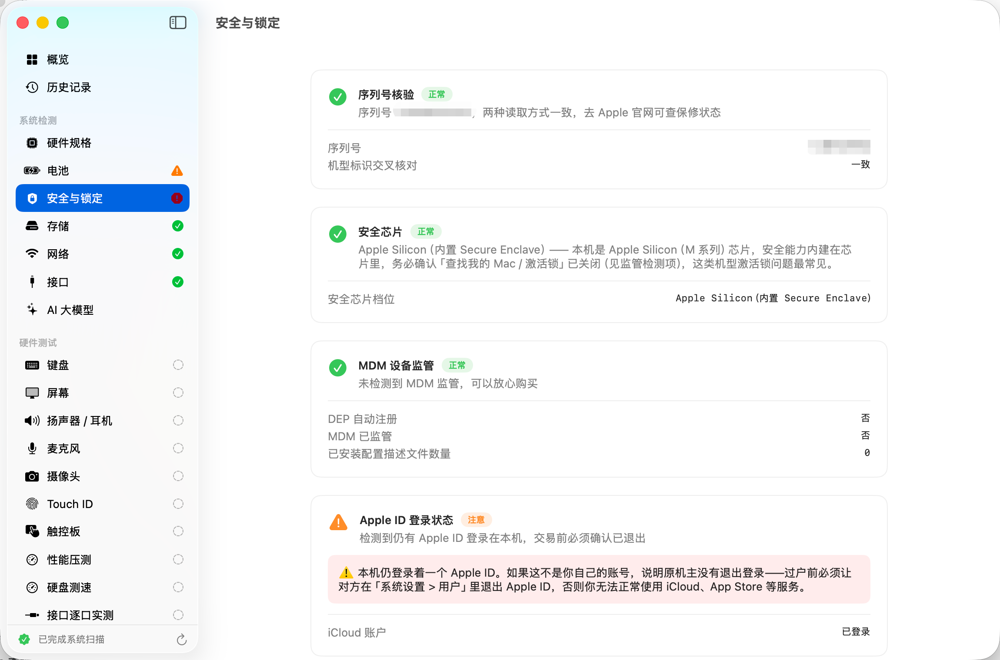
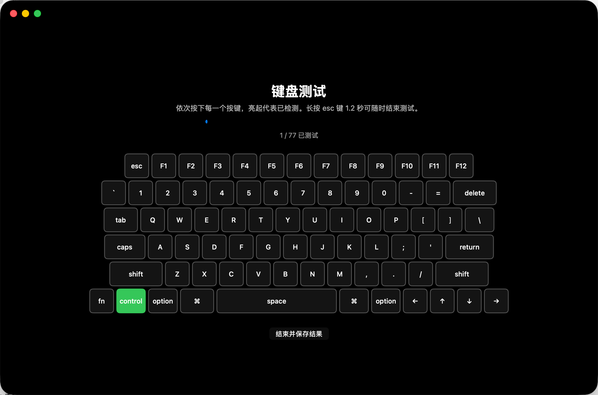

# MacCheck 验机宝

MacCheck 是一款面向二手 Mac 交易、门店验机和个人自检的 macOS 本地验机工具。它会自动读取硬件规格、电池、存储、网络、安全与接口信息，并提供键盘、屏幕、音频、麦克风、摄像头、触控板、硬盘测速等交互测试，最后可导出 PDF 或 PNG 验机报告。

> 隐私说明：MacCheck 默认完全本地运行，不上传序列号、检测结果或报告内容。README 中的图片为真机测试截图，序列号等敏感信息已打码。


## 功能亮点

- 自动识别机型、芯片、内存、macOS 版本、序列号、机型年份等基础信息
- 电池循环次数、健康度、存储空间、网络、蓝牙、接口等自动检测
- MDM、Apple ID / 激活锁、安全芯片等二手机交易高风险项提示
- 键盘逐键点亮、屏幕纯色/灰阶/棋盘格、音频、麦克风、摄像头、Touch ID、触控板等交互测试
- 硬盘读写测速、性能压测、接口逐口实测
- AI 大模型可跑性建议，按本机内存估算本地模型适配度
- 一键导出 PDF / PNG 长图报告，支持保存历史记录便于后续对比
- 支持跟随系统、浅色、深色三种外观主题设置


## 系统要求

- macOS 14.0 或更高版本
- Apple Silicon 或 Intel Mac
- Xcode 16 或更高版本用于源码构建
- 可选：`xcodegen`，用于根据 `project.yml` 重新生成 Xcode 工程

## 快速安装

1. 到 GitHub Releases 下载 `MacCheck-1.2.dmg`。
2. 打开 DMG，将 `MacCheck.app` 拖到 `Applications`。
3. 首次运行如果出现 Gatekeeper 提示，右键点击 App，选择“打开”。
4. 摄像头、麦克风、蓝牙等项目会按需请求系统权限。

当前发布脚本支持 Developer ID 签名与 Apple 公证。如果本机没有配置证书，会生成 ad-hoc 版本，适合本地测试；公开分发建议配置签名和公证。

### 安装后无法打开怎么办

如果 macOS 提示“无法打开，因为无法验证开发者”，可以先尝试右键点击 `MacCheck.app`，选择“打开”。

如果仍然无法打开，或“隐私与安全性”里需要显示“任何来源”，可以打开“终端.app”执行：

```bash
sudo spctl --master-disable
```

执行后输入开机密码并回车。该命令会开启系统设置里的“任何来源”选项，会降低 Gatekeeper 保护，建议只在确认 App 来源可信时使用。

如果 macOS 提示 App“已损坏，无法打开”，通常是下载隔离属性导致。确认已将 App 拖入 `/Applications` 后，在终端执行：

```bash
sudo xattr -rd com.apple.quarantine /Applications/MacCheck.app
```

## 使用流程

1. 打开 MacCheck，等待首页自动完成系统检测。
2. 先查看“概览”和“重大问题”区域，红色项目需要优先确认。
3. 依次进入左侧“硬件测试”项目，完成键盘、屏幕、音频、摄像头等人工确认项。
4. 点击“保存到历史”，保留本次检测快照。
5. 点击“导出报告”，选择 PNG 长图或 PDF。





## 源码构建

```bash
git clone https://github.com/andyhuo520/MacCheck.git
cd MacCheck

# 可选：如果你修改了 project.yml
brew install xcodegen
xcodegen generate

xcodebuild \
  -project MacCheck.xcodeproj \
  -scheme MacCheck \
  -configuration Release \
  -derivedDataPath build_release \
  CODE_SIGN_IDENTITY="-" \
  CODE_SIGNING_REQUIRED=NO
```

构建产物位于：

```text
build_release/Build/Products/Release/MacCheck.app
```

## 打包 DMG

项目内置发布脚本：

```bash
./scripts/build_and_notarize.sh
```

脚本会执行：

1. 如已安装 `xcodegen`，自动重新生成工程
2. Release 构建
3. 检查本机是否存在 Developer ID Application 证书
4. 有证书时执行 hardened runtime 签名、公证和 stapler 装订
5. 无证书时生成本地可运行的 ad-hoc DMG

默认输出：

```text
~/Desktop/MacCheck-1.2.dmg
```

如果要正式分发，请先配置：

```bash
export MACCHECK_SIGN_ID="Developer ID Application: Your Name (TEAMID)"
export MACCHECK_NOTARY_PROFILE="maccheck-notary"
```

并按 Apple 官方流程使用 `xcrun notarytool store-credentials` 保存公证凭证。

## 测试

人工验机项目需要真实硬件参与，建议按 [测试清单](docs/TESTING.md) 执行。

本地基础验证：

```bash
xcodebuild -project MacCheck.xcodeproj -scheme MacCheck -configuration Release -derivedDataPath build_release CODE_SIGN_IDENTITY="-" CODE_SIGNING_REQUIRED=NO
hdiutil verify ~/Desktop/MacCheck-1.2.dmg
codesign -dv --verbose=2 build_release/Build/Products/Release/MacCheck.app
```

## 项目结构

```text
Sources/
  App/                 App 入口与 Info.plist
  Core/                硬件探测、报告、历史记录、系统服务
  Checks/              键盘、屏幕、音频、摄像头等交互测试
  UI/                  SwiftUI 页面、设计系统与导航
scripts/
  build_and_notarize.sh
docs/
  TESTING.md
  RELEASE.md
  assets/
```

## 注意事项

- 本工具用于辅助验机，不替代 Apple 官方保修或售后检测。
- 激活锁、保修状态等强依赖 Apple 服务器的数据，需要用户跳转 Apple 官网确认。
- 某些检测依赖系统权限、机型能力或外接设备，结果会根据环境显示“未支持”或“跳过”。
- 公开截图和报告前请确认序列号、设备名称和个人信息已脱敏。
