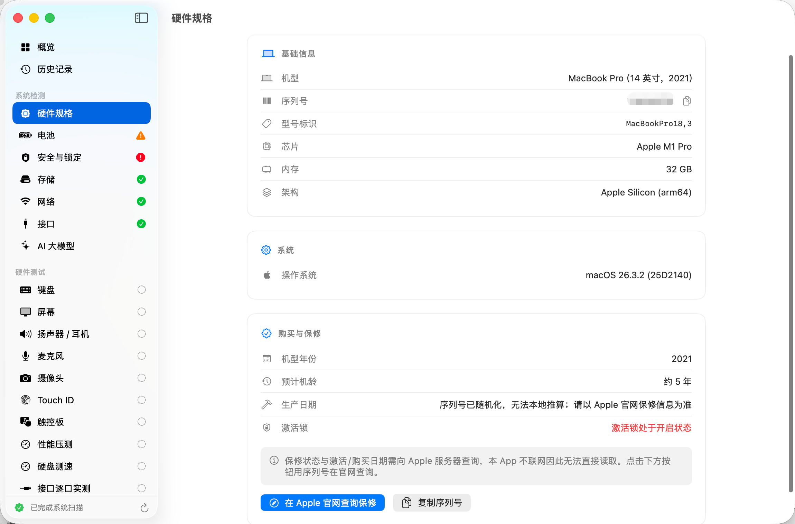

# ToolCheckMacBook

ToolCheckMacBook is a local, privacy-focused macOS hardware diagnostic and verification tool for second-hand Mac transactions, store inspections, and personal health checks. It automatically detects hardware specifications, battery health, storage, network, security, and ports, and provides interactive diagnostic tests for keyboard, screen, audio, microphone, camera, trackpad, disk speed benchmark, and stress testing. Test results can be exported as PDF or PNG hardware reports.

> Privacy Note: ToolCheckMacBook runs completely offline. It does not upload serial numbers, diagnostic results, or report contents to any remote server.


## Highlights

- Automatic hardware identification: model, chip, memory, macOS version, serial number, and release year.
- Battery health analysis: cycle count, health percentage, capacity, and charging status.
- Storage, network, Bluetooth, and physical port detection.
- Second-hand Mac purchase risks: MDM / Enterprise enrollment, Apple ID / Activation Lock status, and Security Chip tier.
- Interactive hardware tests:
  - Keyboard: real-time per-key lighting, stuck key detection.
  - Display: dead pixel, backlight bleed, color gradient, and checkerboard patterns.
  - Sound & Media: stereo audio sweep, live microphone VU meter, camera preview.
  - Sensors & Input: Touch ID biometric check, Force Touch trackpad gestures and pressure.
- Performance & Benchmark: multi-core stress test with thermal monitoring, direct I/O disk read/write speed test.
- AI Model Advisor: estimates local LLM capability based on unified memory.
- One-click export to PDF or long PNG report, with local history tracking and comparison.
- Multiple appearance themes: System, Light, and Dark mode.



## System Requirements

- macOS 14.0 or later
- Apple Silicon or Intel Mac
- Xcode 16 or later (for building from source)
- Optional: `xcodegen` (for generating Xcode project from `project.yml`)

## Building from Source

```bash
git clone <your-repo-url>
cd ToolCheckMacBook

# Generate Xcode project if xcodegen is installed
xcodegen generate

# Build Release version
xcodebuild \
  -project ToolCheckMacBook.xcodeproj \
  -scheme ToolCheckMacBook \
  -configuration Release \
  -derivedDataPath build_release \
  CODE_SIGN_IDENTITY="-" \
  CODE_SIGNING_REQUIRED=NO
```

The built application will be located at:
```text
build_release/Build/Products/Release/ToolCheckMacBook.app
```

## Packaging DMG

A packaging script is included:

```bash
./scripts/build_and_notarize.sh
```

Output file:
```text
~/Desktop/ToolCheckMacBook-1.2.dmg
```

For official distribution with Developer ID signing and notarization:

```bash
export TOOLCHECKMACBOOK_SIGN_ID="Developer ID Application: Your Name (TEAMID)"
export TOOLCHECKMACBOOK_NOTARY_PROFILE="toolcheckmacbook-notary"
./scripts/build_and_notarize.sh
```

## Project Structure

```text
Sources/
  App/                 App entry point, entitlements, and Info.plist
  Core/                Hardware probes, report engine, history store, system services
  Checks/              Interactive tests (Keyboard, Display, Audio, Camera, Disk Speed, etc.)
  UI/                  SwiftUI views, design system, and navigation router
scripts/
  build_and_notarize.sh
docs/
  TESTING.md
  RELEASE.md
  assets/
```

## Disclaimer

- ToolCheckMacBook is designed as an auxiliary inspection tool and does not replace Apple official diagnostics or authorized warranty service.
- Certain cloud-linked features (such as Apple warranty coverage) require checking Apple's official website.
